# Diagrama Entidad-Relación (ER) — Base de datos de Cora

**Hackathon Nicaragua 2026 — Entregable "Diagramación de base de datos"**

> Motor: PostgreSQL 17.6 (Supabase, proyecto `qrrnhigitxqfjrmncwxu`) — 26 tablas, todas con Row
> Level Security habilitado. La demostración formal de 1FN/2FN/3FN y el diccionario de datos
> completo (columnas, tipos, RLS y CHECKs de cada tabla) están en
> [`docs/ESTUDIO_BASE_DE_DATOS_2FN.md`](../docs/ESTUDIO_BASE_DE_DATOS_2FN.md). Este documento es el
> modelo ER visual básico: entidades, claves y relaciones — sin repetir esa auditoría.

## Modelo Entidad-Relación

```mermaid
erDiagram
    PROFILES ||--o{ LIFE_STAGE_HISTORY : registra
    PROFILES ||--|| USER_PREFERENCES : tiene
    PROFILES ||--o{ CONSENTS : otorga
    PROFILES ||--o{ DEVICE_PUSH_TOKENS : registra
    PROFILES ||--|| MEDICAL_BACKGROUND : tiene
    PROFILES ||--o{ CYCLES : genera
    PROFILES ||--o{ DAILY_LOGS : registra
    PROFILES ||--o{ MEDICAL_SUMMARIES : genera
    PROFILES ||--o{ PREGNANCIES : cursa
    PROFILES ||--o{ APPOINTMENTS : agenda
    PROFILES ||--o{ REMINDERS : configura
    PROFILES ||--o{ AI_CONVERSATIONS : inicia
    PROFILES ||--|| MASCOT_STATE : tiene
    PROFILES ||--o{ MASCOT_EVENTS : acumula
    PROFILES ||--o{ FAMILY_CIRCLE_MEMBERS : invita
    PROFILES ||--o{ FAMILY_CIRCLE_MEMBERS : es_invitada
    AVATARS ||--o{ PROFILES : personaliza

    DAILY_LOGS ||--o{ DAILY_LOG_SYMPTOMS : detalla
    SYMPTOM_CATALOG ||--o{ DAILY_LOG_SYMPTOMS : cataloga

    CONTENT_CATEGORIES ||--o{ EDUCATIONAL_CONTENT : clasifica
    EDUCATIONAL_CONTENT ||--o{ CONTENT_SOURCES : cita

    AI_CONVERSATIONS ||--o{ AI_MESSAGES : contiene

    FAMILY_CIRCLE_MEMBERS ||--o{ FAMILY_SHARE_GRANTS : otorga

    HEALTH_CENTERS ||--o{ SPECIALISTS : emplea

    PROFILES {
        uuid id PK
        life_stage life_stage
        int birth_year
    }
    AVATARS {
        uuid id PK
        text name_es
    }
    LIFE_STAGE_HISTORY {
        uuid id PK
        uuid user_id FK
        life_stage life_stage
    }
    USER_PREFERENCES {
        uuid user_id PK, FK
        boolean ai_share_health_context
    }
    CONSENTS {
        uuid id PK
        uuid user_id FK
        text consent_type
    }
    DEVICE_PUSH_TOKENS {
        uuid id PK
        uuid user_id FK
        text expo_push_token
    }
    MEDICAL_BACKGROUND {
        uuid user_id PK, FK
        text blood_type
    }
    CYCLES {
        uuid id PK
        uuid user_id FK
        date start_date
    }
    DAILY_LOGS {
        uuid id PK
        uuid user_id FK
        date log_date
    }
    SYMPTOM_CATALOG {
        uuid id PK
        text label_es
    }
    DAILY_LOG_SYMPTOMS {
        uuid daily_log_id PK, FK
        uuid symptom_id PK, FK
        int intensity
    }
    MEDICAL_SUMMARIES {
        uuid id PK
        uuid user_id FK
        date period_end
    }
    PREGNANCIES {
        uuid id PK
        uuid user_id FK
        date due_date
    }
    APPOINTMENTS {
        uuid id PK
        uuid user_id FK
        timestamptz scheduled_at
    }
    REMINDERS {
        uuid id PK
        uuid user_id FK
        int hour
        int minute
    }
    CONTENT_CATEGORIES {
        uuid id PK
        text name_es
    }
    CONTENT_SOURCES {
        uuid id PK
        uuid content_id FK
        text label
    }
    EDUCATIONAL_CONTENT {
        uuid id PK
        uuid category_id FK
        text title
    }
    AI_CONVERSATIONS {
        uuid id PK
        uuid user_id FK
        text title
    }
    AI_MESSAGES {
        uuid id PK
        uuid conversation_id FK
        text role
    }
    MASCOT_STATE {
        uuid user_id PK, FK
        int level
    }
    MASCOT_EVENTS {
        uuid id PK
        uuid user_id FK
        int points
    }
    FAMILY_CIRCLE_MEMBERS {
        uuid id PK
        uuid owner_id FK
        uuid member_user_id FK
        text status
    }
    FAMILY_SHARE_GRANTS {
        uuid id PK
        uuid membership_id FK
        share_scope scope
    }
    HEALTH_CENTERS {
        uuid id PK
        text name
    }
    SPECIALISTS {
        uuid id PK
        uuid health_center_id FK
        text full_name
    }
```

## Lectura del modelo

- **`profiles` es la entidad central**: casi todas las demás tablas cuelgan de ella por
  `user_id → profiles(id)`, con borrado en cascada (`ON DELETE CASCADE`) — al eliminar una cuenta,
  se elimina toda su información asociada.
- **Relaciones 1 a 1** (`||--||`): `user_preferences`, `medical_background` y `mascot_state`
  comparten la clave primaria con `profiles` (`user_id` es a la vez `PK` y `FK`) — cada usuaria
  tiene exactamente una fila de cada una.
- **Tabla asociativa (muchos a muchos)**: `daily_log_symptoms` resuelve la relación N:M entre
  `daily_logs` y `symptom_catalog` con clave primaria compuesta (`daily_log_id`, `symptom_id`) —
  es el caso que se demuestra formalmente en 2FN en el estudio completo.
- **Auto-relación**: `family_circle_members` referencia `profiles` dos veces (`owner_id` y
  `member_user_id`) — modela quién invita y quién es invitada dentro del mismo círculo familiar.
- **Cadenas de dos niveles**: `educational_content → content_sources` y
  `ai_conversations → ai_messages` — un artículo puede citar varias fuentes, una conversación
  contiene varios mensajes.
- **Dominio de directorio de salud**: `health_centers → specialists`, independiente del resto del
  esquema (no cuelga de `profiles`) — es información pública/compartida, no propia de una usuaria.

## Notas de normalización (resumen)

El estudio completo demuestra 1FN, 2FN y 3FN tabla por tabla. En resumen:
- **1FN**: todos los atributos son atómicos: no hay columnas con listas separadas por comas; los
  datos multivaluados (síntomas por día) usan una tabla asociativa (`daily_log_symptoms`) en vez de
  columnas repetidas.
- **2FN**: 25 de las 26 tablas tienen clave primaria simple, que cumple 2FN trivialmente. La única
  tabla con clave compuesta (`daily_log_symptoms`) se verifica explícitamente: su único atributo no
  clave (`intensity`) depende de la combinación completa `(daily_log_id, symptom_id)`, nunca de una
  parte sola.
- **3FN**: los datos clínicos (`medical_background`), catálogos (`content_categories`,
  `content_sources`) y el directorio (`health_centers` ↔ `specialists`) están desacoplados en
  tablas propias en vez de repetirse dentro de `profiles` o `educational_content`.

Detalle completo, con tipos de dato exactos, restricciones `CHECK` y políticas RLS de cada una de
las 26 tablas: [`docs/ESTUDIO_BASE_DE_DATOS_2FN.md`](../docs/ESTUDIO_BASE_DE_DATOS_2FN.md).
