# Interfaz y Desarrollo — Cora

**Hackathon Nicaragua 2026 — Entregable "Interfaz y Desarrollo"**

> Evidencia real de navegación: capturas tomadas ejecutando la app Cora (Expo + React Native) en
> un emulador Android, con Metro Bundler corriendo en vivo contra el proyecto de Supabase real —
> no son mockups estáticos de diseño. Se registró una cuenta nueva (`hackathon.demo2026@cora.test`)
> y se completó el flujo completo desde cero: bienvenida, registro, onboarding de 7 pasos, las
> pantallas principales de la app ya autenticada, y las pantallas secundarias a las que se accede
> desde Perfil (resumen médico, círculo familiar, citas, recordatorios), además de evidencia de
> idioma Miskitu y de la verificación de seguridad del APK en Google Play Protect.
> Repositorio completo: https://github.com/eduardoevz/Volcanic-2026

## Resumen del flujo probado

| # | Pantalla | Qué se comprobó |
| --- | --- | --- |
| 1 | Bienvenida | Navegación inicial funcional |
| 2 | Inicio de sesión | Formulario de login con campos reales |
| 3 | Crear cuenta | Registro funcional con validación de formato de correo y contraseña |
| 4 | Onboarding — Etapa de vida | Selección funcional, define personalización de toda la app |
| 5 | Onboarding — Últimos períodos | Selector de fecha (date picker) funcional en dos calendarios encadenados |
| 6 | Onboarding — Avatar | Grid seleccionable + hoja de detalle educativo sobre fauna nicaragüense |
| 7 | Onboarding — Antecedentes médicos | Formulario multi-campo + chips de selección única (tipo de sangre) |
| 8 | Onboarding — Privacidad y Cora IA | Switches funcionales, consentimiento explícito antes de continuar |
| 9 | Inicio (Home) | Predicción real de ciclo, chequeo de ánimo, progreso de la mascota, artículo recomendado |
| 10 | Calendario | Calendario poblado con período/fértil/ovulación, más estadísticas y últimos 30 días |
| 11 | Biblioteca | Buscador y filtro de contenido educativo, con artículos reales cargados |
| 12 | Perfil | Modo oscuro, privacidad de IA, idioma, tema y accesos a todos los submódulos |
| 13 | Directorio de salud | Filtros por tipo y departamento, listado completo cargado desde Supabase |
| 14 | Resumen médico | Generado a partir de los registros reales, exportable y compartible |
| 15 | Círculo familiar | Estados vacíos reales de "Mi círculo" y "Comparten conmigo", invitación funcional |
| 16 | Agenda de citas | Cita real agendada, con acciones de completar/cancelar/eliminar |
| 17 | Recordatorios | Recordatorio local funcional, con switch de activación |
| 18 | Idioma Miskitu | Perfil y Home completos traducidos, cambio de idioma funcional |
| 19 | Seguridad del APK | Verificación de Google Play Protect: sin virus, app legítima, sin otros riesgos |

---

## 1. Bienvenida

Pantalla de entrada de la app, con la identidad visual de Cora y navegación hacia el flujo de
acceso.

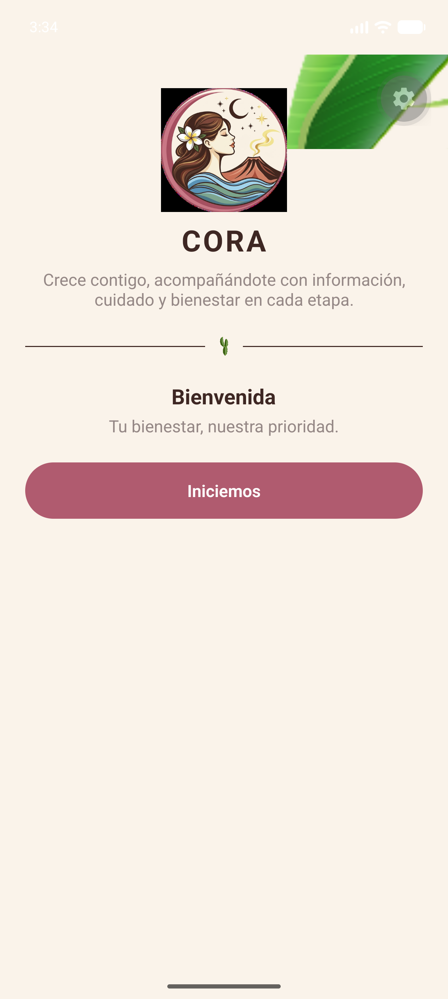

## 2. Inicio de sesión

Formulario de login con campos de correo y contraseña, recuperación de contraseña y acceso con
Google.

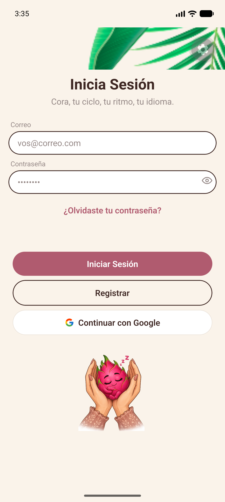

## 3. Crear cuenta (registro funcional)

Formulario de registro real: se completó con un correo y una contraseña, y el botón "Registrarme"
se habilita solo cuando el formato es válido. Este formulario creó la cuenta de prueba usada para
todas las capturas siguientes.

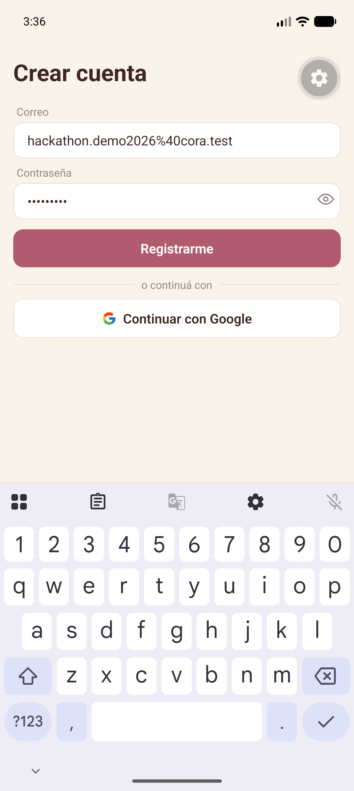

## 4. Onboarding — ¿En qué etapa estás? (Paso 2 de 7)

Selección de etapa de vida (Adolescencia, Adultez, Embarazo, Perimenopausia/Menopausia, Adultez
mayor). Esta elección redefine el contenido, el Home y el calendario de toda la cuenta.

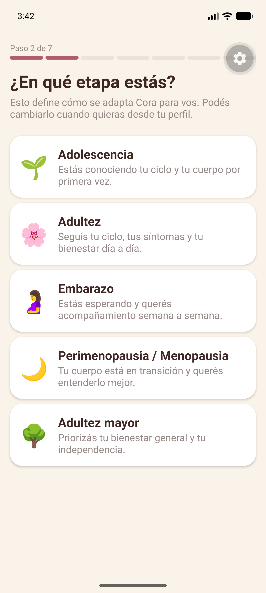

## 5. Onboarding — Tus últimos períodos (Paso 3 de 7)

Dos selectores de fecha encadenados (inicio de la última regla e inicio de la regla anterior) más
un campo de duración de período, para que Cora pueda calcular predicciones desde el primer día.

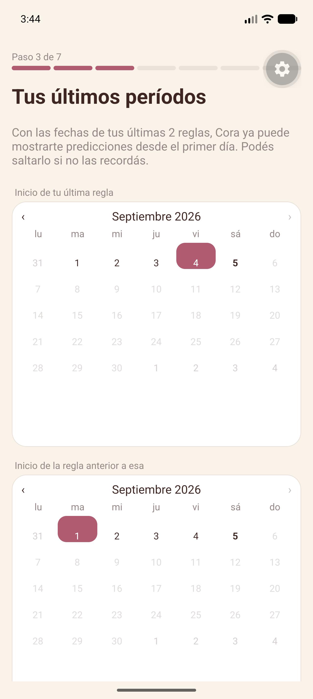

## 6. Onboarding — Elegí tu avatar (Paso 4 de 7)

Grid de 8 especies de fauna nicaragüense seleccionables. Cada una abre una hoja de detalle con
nombre científico, hábitat y estado de conservación antes de confirmar la elección.

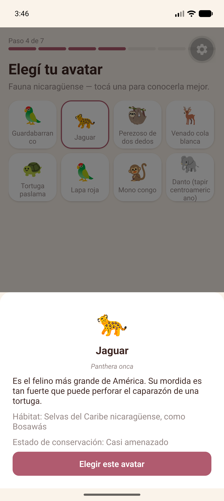

## 7. Onboarding — Antecedentes médicos (Paso 5 de 7)

Formulario opcional de alergias, antecedentes familiares, condiciones crónicas y medicamentos
actuales, más un selector de tipo de sangre por chips de selección única.

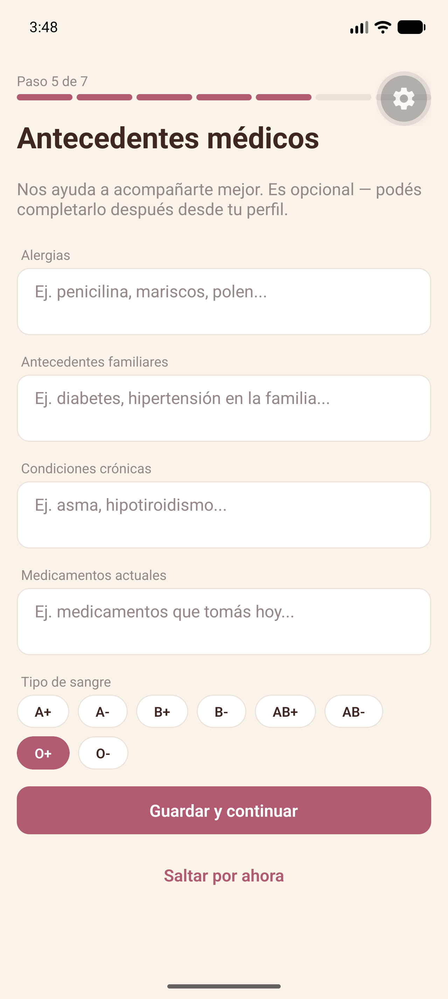

## 8. Onboarding — Privacidad y Cora IA (Paso 7 de 7)

Último paso: switches funcionales para notificaciones y para compartir contexto con la IA
(apagado por defecto), con aviso explícito de que Cora no diagnostica ni sustituye atención médica.

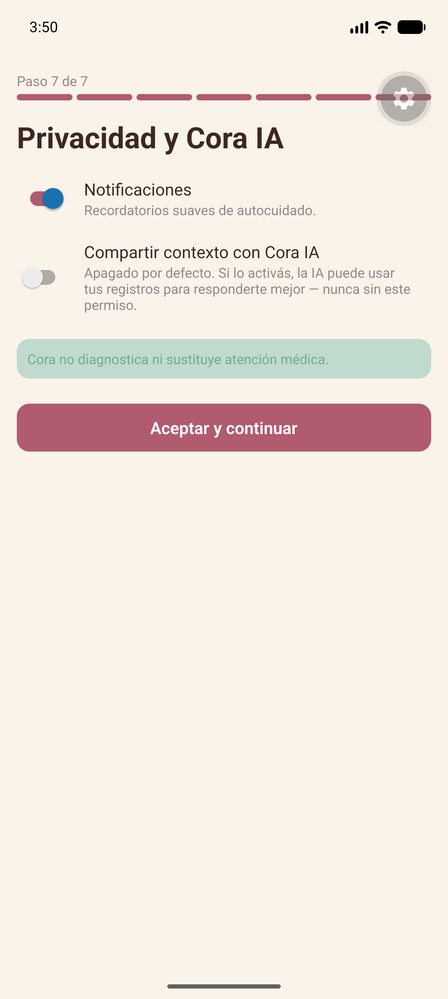

## 9. Inicio (Home)

Con datos reales ya acumulados, el Home muestra una predicción real de ciclo ("Fase folicular",
próximo período estimado con rango de fechas), el chequeo de ánimo del día, el progreso de la
mascota "pitahaya" (nivel y puntos) y un artículo recomendado real de la biblioteca (Ley 779).

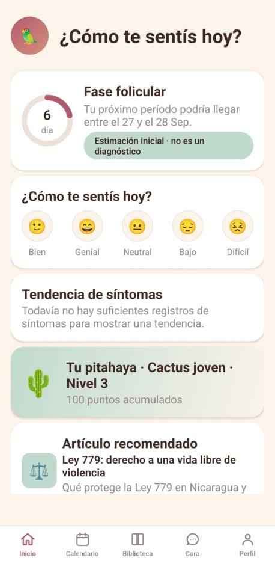

## 10. Calendario

El calendario de ciclo, poblado con período, ventana fértil y ovulación estimada, con leyenda,
predicción del próximo período y ventana fértil con fechas concretas.

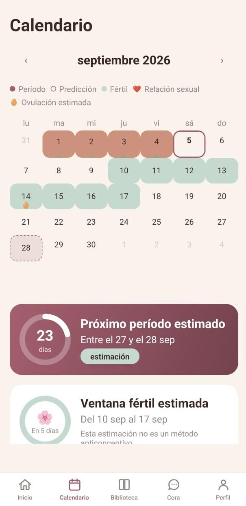

Debajo, acceso a estadísticas y al historial de los últimos 30 días, registro por registro.

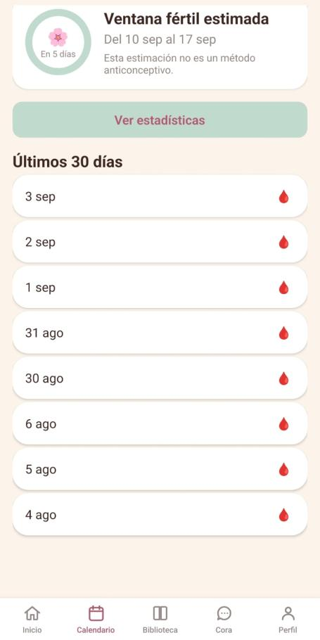

## 11. Biblioteca

Buscador funcional de artículos educativos con filtro por categoría, mostrando artículos reales
con tiempo de lectura y estado de revisión.

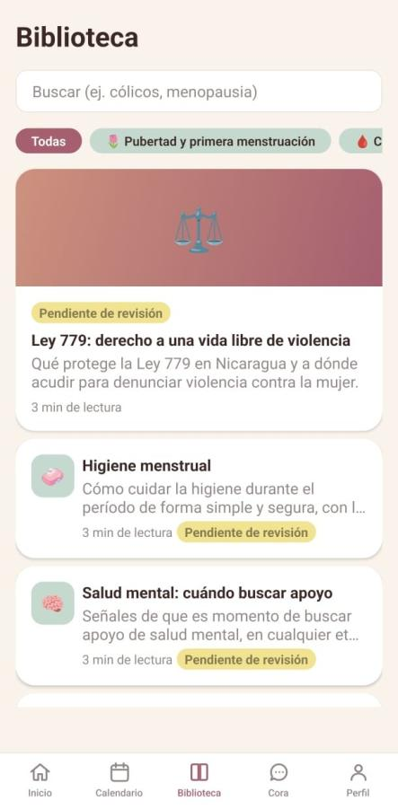

## 12. Perfil (modo oscuro)

Pantalla de ajustes de cuenta en modo oscuro: switch de privacidad de IA, selector de idioma
(Español/Miskitu/Mayangna), selector de tema (Claro/Oscuro/Sistema), y accesos a Resumen médico,
Expediente médico y Recordatorios.

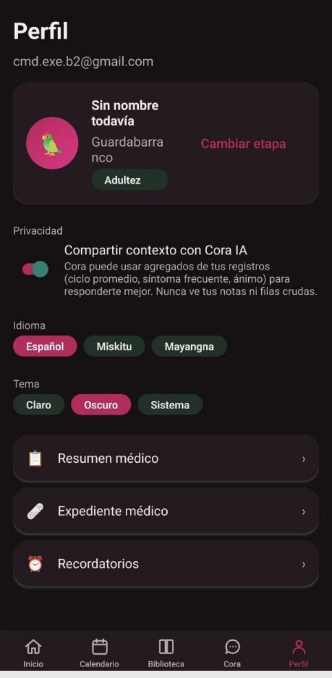

## 13. Directorio de salud

Listado completo de centros de salud por departamento y tipo, con filtros funcionales, cargado en
vivo desde la base de datos de Supabase.

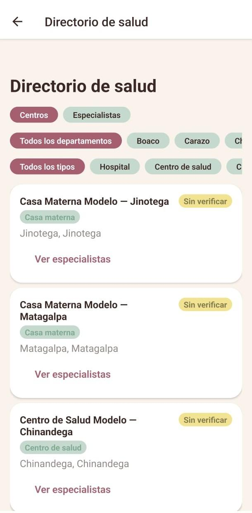

## 14. Resumen médico

Generado a partir de los registros reales de la cuenta, con el aviso "esto NO es un diagnóstico"
siempre visible, filtros por 30/90 días, y acciones para compartir o exportar a PDF.

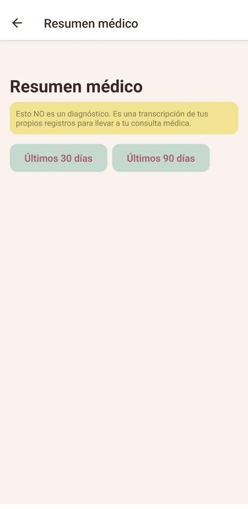

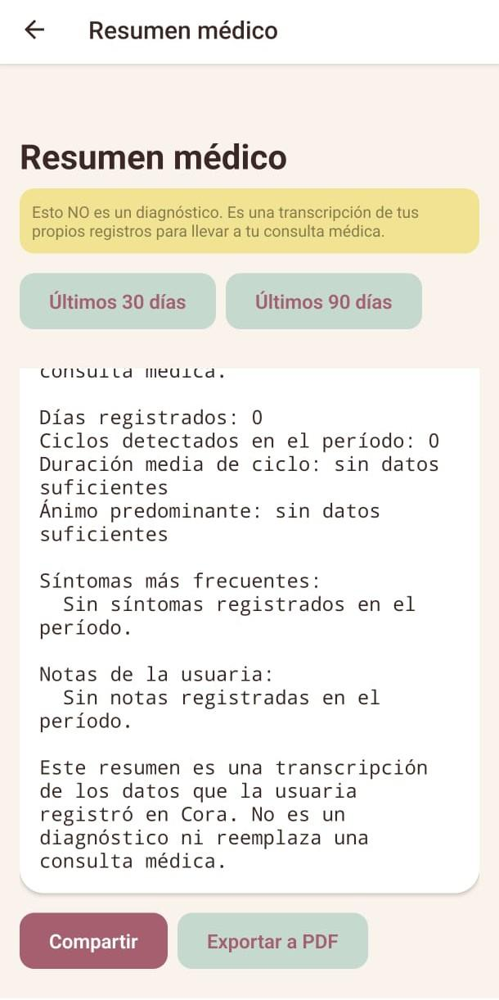

## 15. Círculo familiar

Estados vacíos reales de "Mi círculo" (todavía no invitaste a nadie) y "Comparten conmigo" (nadie
compartió su círculo todavía), con la acción funcional de invitar a alguien.

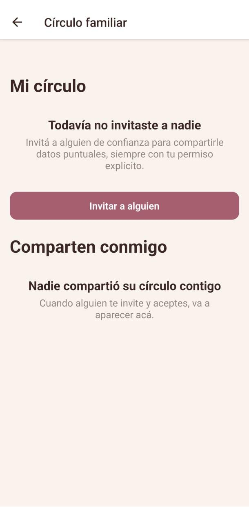

## 16. Agenda de citas

Una cita médica real agendada ("Control general", Hospital Bertha Calderón), con acciones
funcionales para marcarla completada, cancelarla o eliminarla, y creación de citas nuevas.

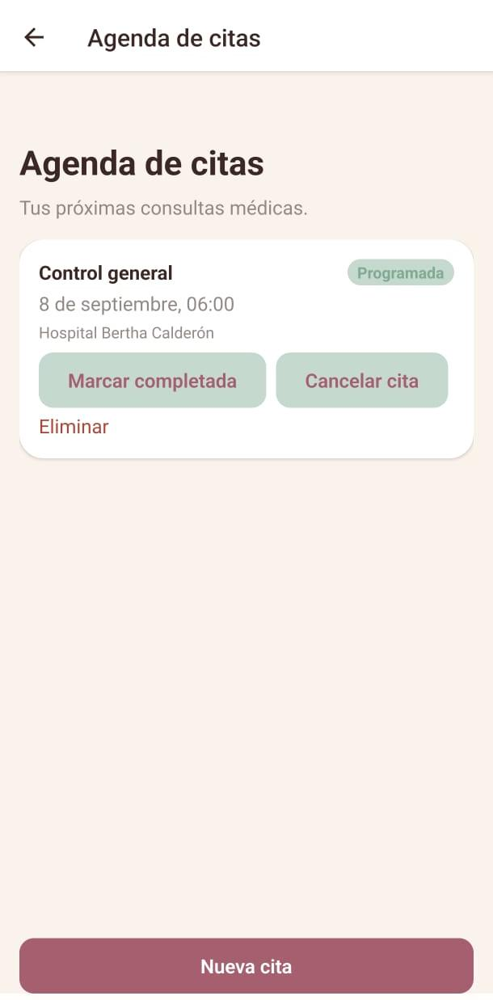

## 17. Recordatorios

Recordatorio local funcional ("Beber agua", 10:00, todos los días) con switch de
activación/desactivación y creación de nuevos recordatorios — no requieren conexión para sonar.

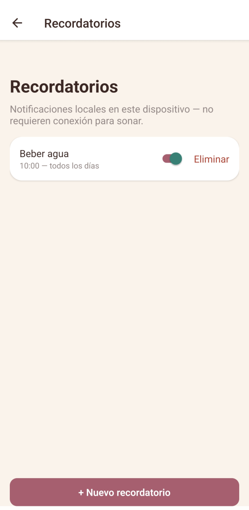

## 18. Idioma Miskitu

Cambio de idioma funcional: Perfil y Home completos, traducidos al Miskitu, mostrando que la
arquitectura de idioma no es solo un selector — el contenido real de la app cambia con él.

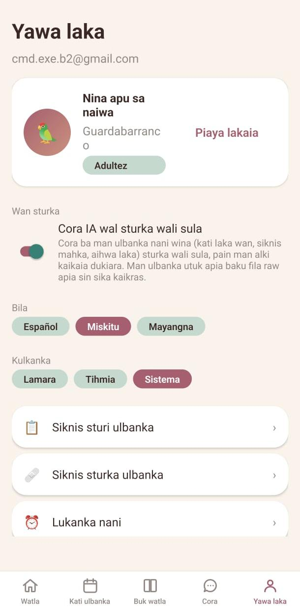

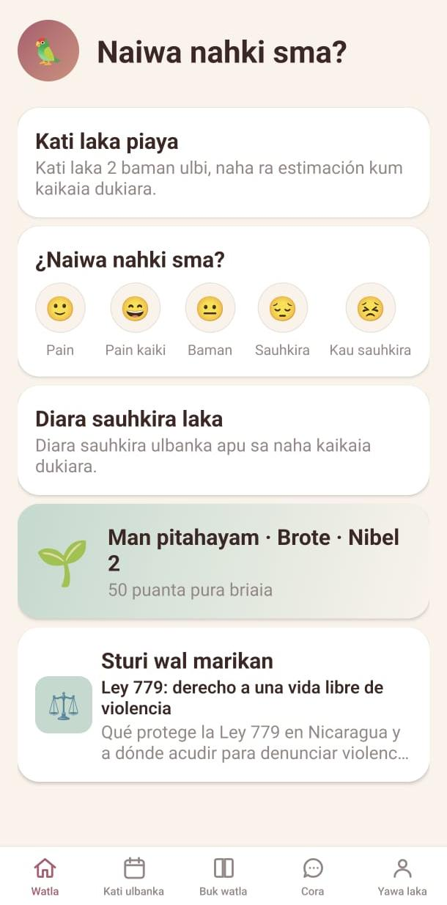

## 19. Verificación de seguridad del APK

Como evidencia adicional de que la app instalable es legítima: el análisis de Google Play Protect
sobre el APK de Cora, sin virus detectados, aplicación verificada como legítima y sin otros
riesgos encontrados.

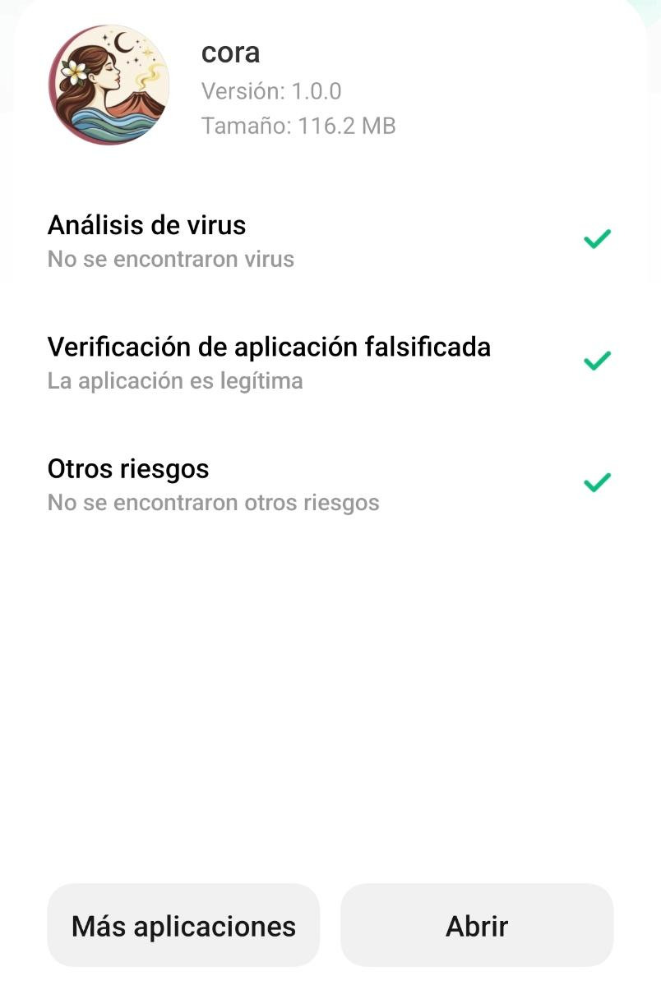

---

## Estructura visual

Toda la app comparte un mismo sistema visual: paleta cálida (marfil, rosa malva, verde salvia,
terracota), tipografía consistente, tarjetas con esquinas redondeadas y sombra suave, y una barra
de navegación inferior fija con 5 pestañas (Inicio, Calendario, Biblioteca, Cora, Perfil) presente
en toda la sección autenticada de la app — incluido su modo oscuro y su traducción a Miskitu.
